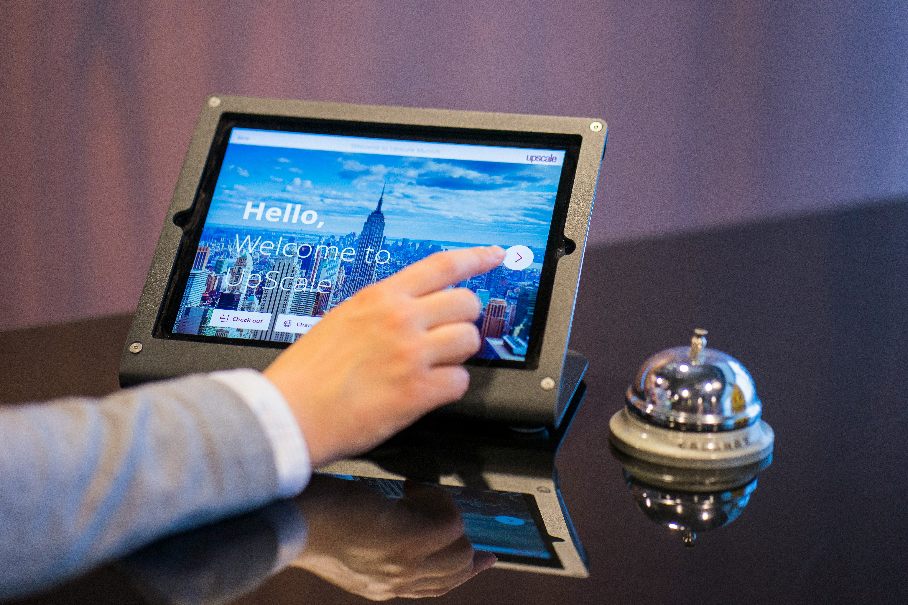

# Unité 1. Arriver en France

## 🎯 Objectifs de l'unité

- Comprendre et utiliser le passé composé
- Parler d’un voyage au passé
- Utiliser le vocabulaire du transport et de l’hébergement
- Interagir dans un hôtel ou à l’aéroport

***

## 1.1. Grammaire : le passé composé


### Définition

Le passé composé exprime une **action passée et terminée.** Il souligne ainsi principalement le **résultat** ou la **conséquence de l’action.** Dans la langue parlée, le passé composé remplace la plupart du temps **le passé simple.**

```
Formation : auxiliaire avoir ou être + participe passé
```

| Avec avoir | *j’ai pris, tu as réservé, nous avons visité* |
| --------- | ------------------------------------------- |
| **Avec être** | ***je suis arrivé(e), ils sont partis*** |
| **Accord du participe avec être** | ***elle est arrivée*** |
| **Négation** | ***je n’ai pas pris le train*** |

### Utilisation

* **Pour une action ponctuelle dans le passé :** *J’ai voyagé hier*
* **Pour une séquence d’actions :** *J’ai pris l’avion et j’ai réservé un hôtel*

### Exemples guidés

- *Je prends l’avion.* → *J’ai pris l’avion.*
- *Tu réserves une chambre.* → *Tu as réservé une chambre.*
- *Elle arrive à l’hôtel.* → *Elle est arrivée à l’hôtel.*
- *Nous visitons Paris.* → *Nous avons visité Paris.*

***

## 1.2. Lexique : le transport et l’hébergement


**Transport :**

- avion 
- train 
- métro 
- billet 
- gare 
- aéroport


**Hébergement :**

- hôtel 
- auberge 
- réservation 
- chambre 
- réception



**Verbes :**

- louer 
- arriver 
- partir 
- séjourner

**Exemple de communication :**

> – Bonjour, j’ai une réservation au nom de Dupont.

> – Oui, voici votre chambre.

**Formule utile :**

> – Bonjour, je voudrais une chambre, s’il vous plaît.
