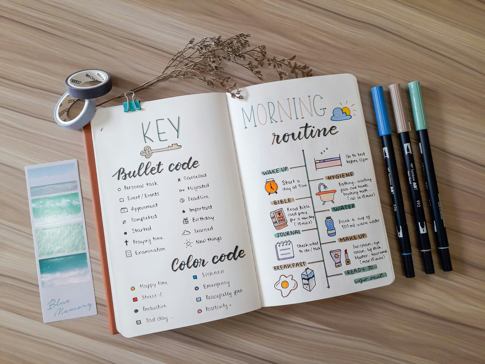

# Unité 2. La vie quotidienne

## 🎯 Objectifs de l'unité

- Comprendre la différence entre imparfait et passé composé
- Décrire des habitudes dans le passé
- Raconter des actions et des situations passées
- Utiliser le vocabulaire de la routine

***

## 2.1. Grammaire : l'imparfait vs le passé composé


### Définition

L’imparfait exprime et décrit des **faits** et **actions** dans le passé en soulignant **le déroulement** ou **la répétition** de ceux-ci. C’est le temps du récit, en premier lieu dans la **langue écrite.**

```
Formation: radical de nous + -ais, -ais, -ait…
```

> **Exemple :** *je travaillais, nous mangions*

### Utilisation

* **Cuando se trata de rutinas :** *Je me levais à 8h*
* **Cuando se trata de una descripción :** *Il faisait beau*

### Contraste avec le passé composé

* **Acción puntual :** *Je suis allé au travail*
* **Contexto :** *Il faisait froid quand je suis sorti*

***

## 2.2. Lexique : la routine



**Actions quotidiennes (verbes) :**

- se lever
- se coucher
- travailler
- étudier
- prendre le petit déjeuner
- faire les courses

**Moments de la journée :**

- matin
- après-midi
- soir
- nuit

**Fréquence :**

- toujours
- souvent
- parfois
- rarement

**Exemple de communication :**

> – Qu’est-ce que tu faisais hier soir ?

> –  Je regardais la télévision quand tu as appelé.

***

## Auto-évaluation

À la fin de cette unité, vérifiez si vous pouvez:

- expliquer la différence entre l'imparfait et le passé composé;
- décrire une habitude passée;
- raconter une action ponctuelle dans le passé;
- écrire trois phrases sur votre routine d'hier.
