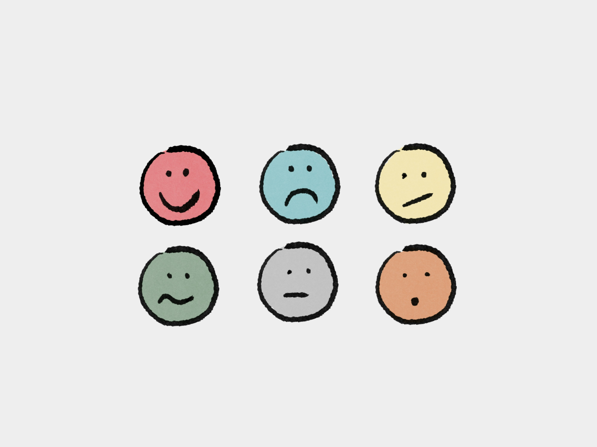

# Unité 3. Interagir et résoudre des problèmes

## 🎯 Objectifs de l'unité

- Utiliser des expressions pour demander de l’aide et se plaindre
- Interagir dans des situations problématiques (hôtel, service, etc.)
- Comprendre et utiliser les pronoms COD et COI
- Améliorer la communication orale et écrite

***

## 3.1. Fonctions communicatives : demandes et plaintes



### Demander poliment

Pour formuler des demandes de manière **polie,** on utilise des formules telles que :

> Je voudrais…

> Pouvez-vous m’aider ?

> Est-ce que vous pouvez… ?

> Je voudrais parler à quelqu’un, s’il vous plaît.

```
Ces expressions sont indispensables dans la vie quotidienne.
```

### Se plaindre

Pour faire part d'un problème ou se plaindre :

> Il y a un problème

> La chambre n’est pas propre

> Je ne suis pas satisfait(e)

> Pouvez-vous trouver une solution ?

```
Très utile en voyage.
```

***

## 3.2. Grammaire : les pronoms compléments

### COD (complément d’objet direct)

Ils sont utilisés pour **remplacer** le complément d'objet direct :

| Me | Nous |
| -- | ---- |
| **Te** | **Vous** |
| **Le/La** | **Les** |

> **Exemple :** Je prends ***le train*** → Je ***le*** prends

> **Autre exemple :** Je prends ***la chambre*** → Je ***la*** prends

### COI (complément d’objet indirect)

Ils sont utilisés avec les verbes qui prennent **à** :

| Me | Nous |
| -- | ---- |
| **Te** | **Vous** |
| **Lui** | **Leur** |

> **Exemple :** Je parle ***à*** Marie → Je ***lui*** parle

> **Autre exemple :** Je parle ***au réceptionniste*** → Je ***lui*** parle

### Position des pronoms

```
Les pronoms se placent avant le verbe :

- Je ne le vois pas
- Je lui parle
```

**Attention :**

- *le / la / les* remplacent une chose ou une personne sans **à**.
- *lui / leur* remplacent une personne introduite par **à**.

***

## 3.3. Lexique utile


**Vocabulaire lié aux situations problématiques et à leur résolution :**

- problème
- solution
- service
- aide
- information

**Exemple de communication :**

> – Excusez-moi, je ne trouve pas ma réservation.

> –  Je vais vous aider.

**Mini-dialogue guidé :**

> – Excusez-moi, il y a un problème dans ma chambre.  
> – Qu’est-ce qu’il y a ?  
> – La chambre n’est pas propre. Pouvez-vous m’aider ?
