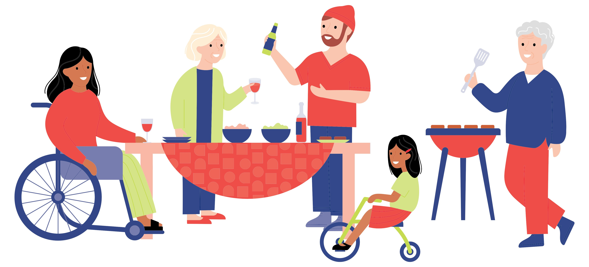

# Unité 4. Culture et communication

## 🎯 Objectifs de l'unité

- Comprendre des aspects de la culture française
- Utiliser les formules de politesse adaptées
- Différencier le registre formel et informel
- Adapter son langage selon la situation

***

## 4.1. Contenus culturels

### Coutumes en France

- **Horaires :** les repas sont plus structurés (déjeuner, dîner)
- **Salutations :** dire *bonjour* est essentiel
- **Importance de la politesse** dans les interactions quotidiennes

```
En France, dire bonjour avant de parler est très important.
```

### Vie quotidienne : la ville vs la campagne

- **La vie quotidienne en ville :** rythme de vie *plus rapide*


- **La vie quotidienne à la campagne :** vie *plus calme* dans les zones rurales


***

## 4.2. Registres formels et informels

### Registre informel (tu)

**Utilisé avec :**

- amis
- famille
- personnes du même âge



**Expressions :**

> Salut, tu vas bien ?

> On se voit ce soir ?

### Registre formel (vous)

**Utilisé avec :**

- inconnus
- contextes professionnels
- personnes que l’on respecte


**Expressions :**

> Bonjour, comment allez-vous ?

> Pourriez-vous m’aider ?

```
Le tutoiement peut être perçu comme un manque de respect avec un inconnu.
Le vouvoiement peut créer de la distance avec un proche.
```

#### Expressions utiles

- demander poliment : *Pourriez-vous m’indiquer…*
- proposer (informel) : *On se voit ce soir ?*
- saluer dans une situation formelle : *Bonjour Madame / Monsieur*
- saluer dans une situation informelle : *Salut !*

**Exemples de choix du registre :**

| Situation | Registre conseillé | Exemple |
| --------- | ------------------ | ------- |
| Avec un ami | Informel | *Salut, tu vas bien ?* |
| À l’accueil d’un hôtel | Formel | *Bonjour, pourriez-vous m’aider ?* |
| Avec un professeur | Formel | *Vous pouvez répéter, s’il vous plaît ?* |

**Exemple de communication :**

> – Bonjour Madame, pourriez-vous m’aider ?  
> – Bien sûr, je vous écoute.

***

## Auto-évaluation

À la fin de cette unité, vérifiez si vous pouvez :

- identifier une situation formelle et une situation informelle ;
- choisir entre tu et vous selon le contexte ;
- utiliser deux formules de politesse ;
- expliquer un aspect simple de la culture française.
